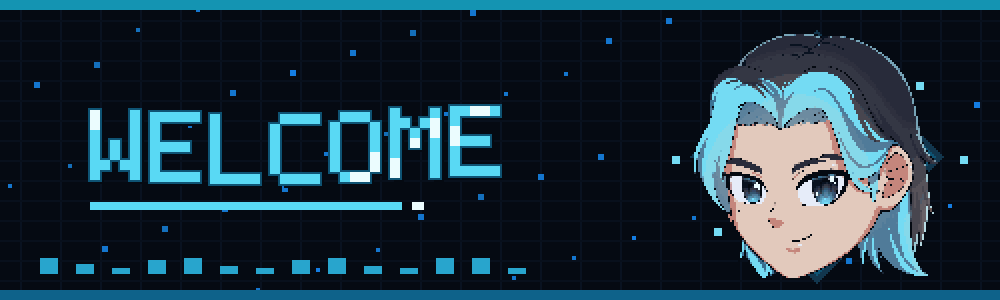
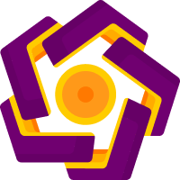

  

  

<h1 align="center">Ivan Susendra — Vanszas</h1>

  <b>Game Developer | Gameplay Programmer | 3D Modeler</b>

  Building horror game experiences, gameplay systems, and Unreal Engine tools with a focus on atmosphere, interaction, and performance.

  

  
  
  
  
  

  

<table align="center" width="100%">
  <tr>
    <td width="33%" align="center" valign="top">
      <h3>📍 Base</h3>
      
Yogyakarta, Indonesia

    </td>
    <td width="34%" align="center" valign="top">
      <h3>🎓 Education</h3>
      
AMIKOM Alumnus Angkatan 98 (Class of 2026)

    </td>
    <td width="33%" align="center" valign="top">
      <h3>🏢 Studio</h3>
      
Co-Founder Monokotil Studio

    </td>
  </tr>
  <tr>
    <td width="33%" align="center" valign="top">
      <h3>🚀 Core Stack</h3>
      
Unreal Engine 5 C++ & Blueprints

    </td>
    <td width="34%" align="center" valign="top">
      <h3>🕹️ Active Project</h3>
      
Building <b>DontIn</b> Psychological Horror

    </td>
    <td width="33%" align="center" valign="top">
      <h3>🎯 Focus Areas</h3>
      
Horror Systems &bull; UI/UX Tools & Performance

    </td>
  </tr>
</table>

## 🙋‍♂️ About Me

I am a game developer originally from Gunungkidul, Yogyakarta, Indonesia, and an alumnus of Universitas AMIKOM Yogyakarta (Angkatan 98, entering in 2022 and graduating in 2026). I focus on Unreal Engine 5 development, specializing in gameplay systems, horror mechanics, technical UI/UX implementation, 3D asset creation, and developing custom technical game tools that streamline production.

As the Co-Founder of Monokotil Studio, I am currently building **DontIn**, an original first-person psychological horror game. My goal is to bridge the gap between design and gameplay programming, ensuring that immersive atmospheres and complex game mechanics function together seamlessly and performantly.

## 🎓 Education & Background

<table width="100%">
  <tr>
    <td width="15%" align="center" valign="middle">
      
    </td>
    <td>
      <h3>Universitas AMIKOM Yogyakarta</h3>
      

        <b>Alumnus — Angkatan 98 (Class of 2026 / Entering 2022)</b> 
        Deepening my background in technology and digital creation, paving the way for advanced technical workflows in game development, gameplay programming, and real-time visualization.
      

    </td>
  </tr>
</table>

## 🛠️ Currently Building

I am currently developing **DontIn**, a first-person psychological horror game built in Unreal Engine 5 under Monokotil Studio. The project serves as the culmination of my gameplay programming and technical implementation skills.

Key development focuses include:
- **Atmosphere & Cinematic Horror Flow**: Building immersive environments using dynamic lighting, fog, and weather.
- **Modular Horror Systems**: Dynamic, event-driven scare triggers and interactive systems.
- **Deep Gameplay Interaction**: Portal-door mechanics, dialogue systems, and high-fidelity player interactions.
- **Game UI/UX Implementation**: Creating an in-game desktop OS style interface and in-game UI.
- **Built-in Performance & Benchmark Tools**: Integrating real-time hardware benchmarking and diagnostics inside the game.

## ⚡ What Makes My Work Different

I bridge the gap between creative design and technical implementation. I do not just design UI layouts or draft gameplay concepts—I write the C++ and Blueprint systems that bring them to life, optimize their performance, and integrate them directly into the playable experience. Whether it is a modular horror trigger or a complex in-game computer interface, my goal is to ensure every system is fully functional, scalable, and responsive.

## 🎮 Featured Projects

<table width="100%">
  <tr>
    <td width="50%" valign="top">
      <h3>🕹️ DontIn</h3>
      
<i>An original first-person psychological horror game built in Unreal Engine 5 under Monokotil Studio.</i>

      <ul>
        <li><b>Modular Horror:</b> Event-driven trigger & scare systems</li>
        <li><b>Mechanics:</b> Dialogue, choices, & door-portal mechanics</li>
        <li><b>Gameplay UI:</b> Interactive in-game desktop OS interface</li>
        <li><b>Performance:</b> Built-in benchmarking & analysis tools</li>
        <li><b>Tech:</b> UE5, C++, Blueprints, UI/UX Implementation</li>
      </ul>
    </td>
    <td width="50%" valign="top">
      <h3>🌧️ Monocots Horror Atmosphere</h3>
      
<i>Unreal Engine 5 horror atmosphere plugin for weather-driven real-time visual and audio control.</i>

      <ul>
        <li><b>Dynamic Weather:</b> Rain, fog, thunder, wetness, & puddles</li>
        <li><b>Visual FX:</b> Customized Niagara particle systems</li>
        <li><b>Audio:</b> Procedural ambient sound control layers</li>
        <li><b>Tooling:</b> Artist-friendly Editor workflows & mood controls</li>
        <li><b>Tech:</b> UE5, C++, Niagara, Material System, Editor Tooling</li>
      </ul>
    </td>
  </tr>
  <tr>
    <td colspan="2" valign="top">
      <h3>🌐 Monokotil Studio Website</h3>
      
<i>Studio and portfolio web application built to display active projects, developer profiles, and studio branding.</i>

      <ul>
        <li><b>Features:</b> Fully responsive UI, modern portfolio layout, and database-backed dynamic listings</li>
        <li><b>Tech Stack:</b> Next.js, Tailwind CSS, Supabase, Prisma</li>
      </ul>
    </td>
  </tr>
</table>

## 🔧 Technical Highlights

* **Modular Horror Trigger System**
  * *A flexible trigger/action structure for building horror events, player reactions, and cinematic scares.*
* **In-Game OS Interface**
  * *Interactive desktop-style UI system for game-world computer interactions, files, browser, and player-facing information.*
* **Dialogue and Choice Flow**
  * *Dialogue system with player choices, sequencer-friendly control, and UI interaction flow.*
* **Loading and Credits Flow**
  * *Game flow systems for loading transitions, credits scenes, input handling, and cinematic presentation.*
* **Benchmark & Performance Result System**
  * *Built-in benchmark tools with FPS graph, hardware info, result widgets, and performance recommendations.*
* **Horror Atmosphere & Weather Plugin**
  * *Dynamic horror atmosphere system with rain, fog, thunder, wetness, puddles, Niagara FX, and audio layers.*
* **UI/UX Implementation for Gameplay**
  * *Designing and implementing UI directly into functional gameplay systems, not only visual mockups.*

## 🛠️ Tech Stack

  
  
  
  
  
  
  
  
  
  
  
  

## 📚 Learning Focus

* 🚀 **Advanced Unreal Engine C++** gameplay architectures & systems
* ⏱️ **Performance profiling** & advanced optimization workflows
* 🕯️ **Advanced horror environments**, lighting, and level design
* 📦 **Indie production workflows** for efficient solo & small-team pipelines

## 🤝 Open to Collaborate

I am always interested in discussing new opportunities, especially regarding:
* 💀 First-person psychological horror projects
* ⚙️ Unreal Engine gameplay mechanics & tool development
* 🖥️ Technical UI/UX design & integration
* 🕹️ Indie game jams & collaborative prototype building

  
<b>📊 View GitHub Statistics</b>

   
  

    
    
  

  

    
  

## 🏆 Contribution Grid Snake

  
  

  

